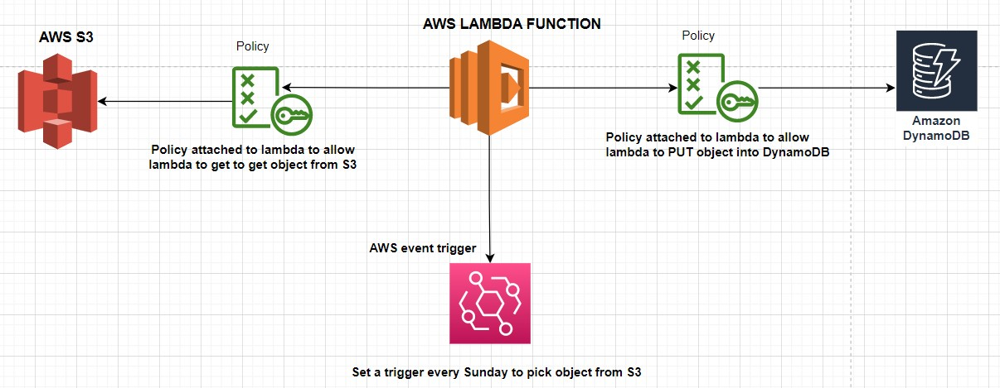

# Ingect CSV Data from S3 to DyanamoDB

## Architecture Overview of my Solution

In other to solve this problem, I attacked it by first trying suggested solution manually following these steps:

- Created AWS resource (S3 and DynamoDB) manually
- Uploaded the the CSV file on S3 bucket 
- Created table on dynamodb with the required columns
- Convert csv file to Json manually then upload it back to s3 
- import json file to Dynamodb

With this manual step, I learned that DyanmoDb table has to follow column in the csv table

### Automating my process using Lambda

- Created Lambda function manually
- Added policy to Get object from s3 and to put object to DynamoDb to the default role created by Lambda
- Set trigger using event Bridge to run lambda function every sunday evening

### Explanation of Python Script

The script is in 3 stages and it is as follow

- Get csv files from s3 bucket
- convert csv to json format
- upload json data into dynamoDb

